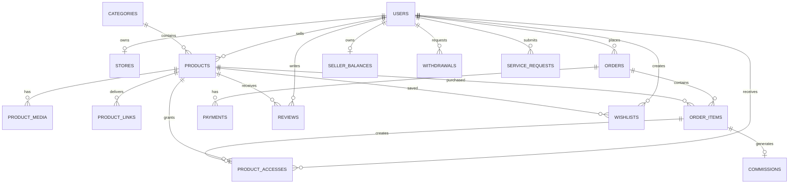

# 07 — ERD

## ERD Principles

- Order item stores snapshots of product price/title so historical orders remain stable.
- Payment status must be verified server-side.
- Product access should be tied to a successful order/order item.
- Delivery URL must not be exposed publicly before purchase.
